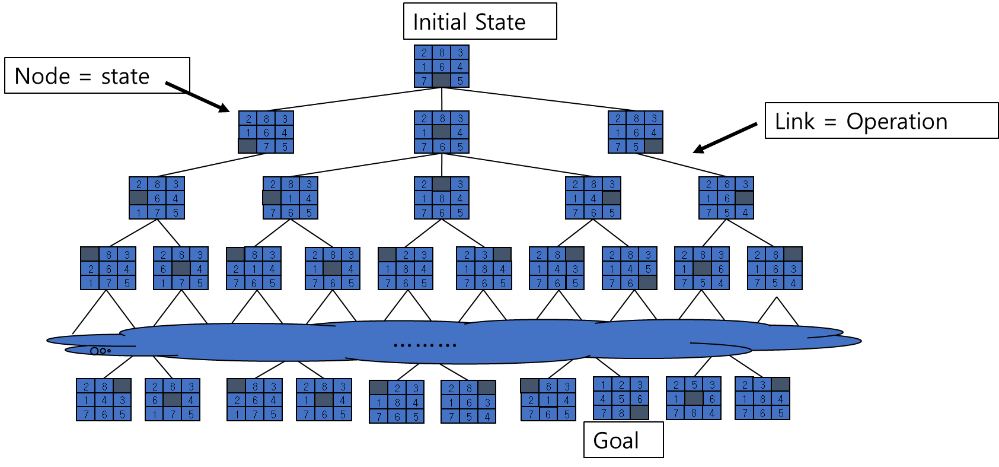

# Search and Optimization
## Search Space (State Space)
Quiz: 선교사-식인종 강 건너기
- 2인용 배를 타고 강을 건널 때 어디서든 선교사 $\geq$ 식인종
- 문제 해결 즉 목표 상태가 될 때까지

## Blind Search
### 1. Depth First Search (깊이 우선 탐색)
- 초기 노드에서 시작하여 **깊이 방향**으로 탐색
- 목표 노드에 도달하면 종료
- 더 이상 진행할 수 없으면, **백트랙킹 (backtracking, 뒤짚어가기)
- 방문한 노드는 재방문하지 않음

- A B F G C H I N D J O P E K L Q

- 장점:
    - 탐색과정에서 메모리 사용은 선형적으로 증가하여 효율적인 메모리 사용 가능
- 단점:
    - State space tree에서 깊이가 제한되지 않으면 문제 해결 보장 불가
    - 최단 경로 해 탐색 보장 불가
### 2. Breadth First Search (너비 우선 탐색)
- 초기 노드에서 시작하여 **모든 자식 노드**를 **확장**하여 생성
- 목표 노드가 없으면 **단말노드**에서 다시 **자식 노드 확장**

- A B C D E F G H I J K L M N O P Q

- 장점
    - 해가 존재한다면 반드시 탐색 가능
    - 최적의 해 탐색 가능
- 단점
    - 메모리 사용이 exponential하게 증가

### 3. Iterative Deepening Search (반복적 깊이 심화 탐색)
- **깊이 한계**가 있는 깊이 **우선 탐색**을 **반복적**으로 적용

- Level 0: A
- Level 1: A B C
- Level 2: A B F G C H I D J E K L M
- Level 3: A B F G C H I N D J O P E K L Q

- 장점
    - 최적의 해 탐색 가능
    - 효율적인 메모리 사용
- 단점
    - 반복적으로 깊이 우선 탐색을 실시함에 따라 비효율성이 존재하나 BFS에 비해 크게 늘지는 않음

### 4. Bidirectional Search (양방향 탐색)
- **초기 노드**와 **목적 노드** 에서 동시에 **BFS** 진행
- 중간에 만나도록 하여 초기 노드에서 목표 노드로의 최단 경로를 찾는 방법
- BFS와 같은 효과, 그러나 적은 수의 노드를 생성함으로 메모리 사용과 시간에서 유리

## Heuristic Search (정보이용 탐색)
- Heuristic: a method of learning or solving problems that allows people to discover things themselves and learn from their own experiences; 신속하게 어림짐작

- Heuristic 비용 추정
    - 현재 위치에서 목적지까지 직선 거리
    - 제자리에 있지 않는 타일의 개수
    - 충돌하는 회수

### 1. Hill Climbing
- 현재 노드에서 휴리스틱에 의한 평가값이 **가장 좋은 이웃 노드** 하나를 확장해 가는 탐색 방법

- Local optimal solution problem -> Different starting point, Iteration

### 2. Best First Search (최상 우선 탐색)
- 확장 중인 노드들 중에서 목표 노드까지 **남은 거리가 가장 짧은 노드**를 확장하여 탐색
- 남은 거리를 정확히 알 수 없으므로 **휴리스틱** 사용

### 3. A* Search
- 목표를 찾는 것 뿐만 아니라 목표 상태로 도달하는데 소요되는 비용을 최소화 필요

$f(n)$: 노드 $n$을 경유하는 전체 비용
    현재 노드 $n$까지 이미 투입된 비용 $g(n)$과 목표 노드까지의 남은 비용 $h(n)$의 함

$$f(n) = g(n) + h(n)$$

$h(n)$: 남은 비용의 정확한 예측 불가
    -> $\hat{h}(n)$: $h(n)$에 대응하는 휴리스틱 함수 (heuristic function)

$\hat{f}(n)$: 노드 $n$을 경유하는 추정 전제 비용
        
$$\hat{f}(n) = g(n) + \hat{h}(n)$$

- A* 알고리즘은 추정 전체비용 $\hat{f}(n)$을 최소로 하는 노드를 확장해 가는 방법

만일 휴리스틱 함수 모든 $n$에 대해  $\hat{h}(n) ≤ h(n)$, A* 알고리즘은 항상 최적해를 갖게 됨

   - 결국, 휴리스틱 함수 $\hat{h}(n)$을 얼마나 잘 추정하는 지에 따라 A* 알고리즘의 성능 결정

## Search in Game
- Game State Tree: 상대가 있는 게임에서 자신과 상대방의 가능한 게임 상태
- 자신의 순서에서는 최대한 유리한 상태 선택, 상대방 순서에서는 최대한 불리한 상태 선택
- 많은 수를 볼수록 유리

### 1. Mini-Max 알고리즘
- MAX 노드: 자신에 해당하는 노드로 자기에게 유리한 최대값 선택
- MIN 노드: 상대방에 해당하는 노드로 최소값 선택
- 단말 노드부터 위로 올라가면서 최소 (minimum) - 최대 (maximum) 연산을 반복하여 자신이 선택할 수 있는 방법 중 가장 좋은 것은 값을 결정

### 2. $\alpha-\beta$ Pruning
- Mini-Max 알고리즘에서 모든 트리를 탐색할 필요가 있을까?

- 어떤 노드에 값이 있다면 Max node에서 하한 값, Min node에서 상한 값 역할

- 검토할 필요가 없는 부분은 탐색 제외
    - 깊이 우선 탐색으로 MAX노드와 MIN노드의 값을 결정하면서
- $\alpha$ cut-off: MIN 노드의 현재값이 부모노드의 현재 값보다 작거나 같으면, 나머지 자식 노드 탐색 중지

- $\beta$ cut-off: MAX 노드의 현재 값보다 같거나 크면, 나머지 자식 노드 탐색 중지

### 3. Monte Carlo Tree Search
- Monte Carlo Simulation: 난수를 이용하여 함수의 값을 확률적으로 계산하는 알고리즘

- 예) $\pi$값 계산
    - Uniform distribution으로 정사각형내 점 선태
    - 충분히 반복한 후

    - $$\frac{원 안의 샘플 개수} {전체 샘플의 개수} = \frac{\pi}{4}$$

- Mini-Max 알고리즘은 최적의 해를 찾을 수 있으나 모든 게임 트리를 탐색
- $\alpha-\beta$ Pruning은 효율적이지만 여전히 대부분의 게임 트리 탐색 필요

- Monte Carlo Tree Search
    - 랜덤한 게임 플레이를 반복하고 그 결과를 반영하여 최선의 결과를 선택
    - 최적의 해를 보장하지는 않지만 대규모 게임 트리에 적용 가능
    - 제한 시간에 맞추어 탐색 (Random Play -> 탐색 시간이 길 수록 더 나은 결과)

#### Monte Carlo Tree basic idea
- 나와 상대방은 왼쪽과 오른쪽 둘 중 하나 선택 가능
- 게임이 끝날 떄까지 랜덤하게 선택
- 4번 시도했더니 왼쪽 선택 시 2번 이기고 오른쪽 선택 시 2번 패배, 어느 쪽 선택?
- 3번 시도했더니 왼쪽 선택 시 2번 이기고 오른쪽 선택시 1번 패배, 어느 쪽 선택?
    - Exploitation
- 4번 시도했더니 왼쪽 선택 시 2번 이기고 1번 패배, 오른쪽 선택 시 1번 패배, 어느 쪽 선택?
    - Exploration

#### Multi Armed Bandit (MAB) Problem
- n개의 슬롯머신에서 한번에 1개의 슬롯머신만 시도 가능
- 각 슬롯머신은 각각 다른 승률
- 정해진 시간동안 수익을 극대화하려면?

- Greedy $\epsilon$-Greedy, adaptive $\epsilon$-Greedy
- Upper Confidential Bound (UCB)
- Thomson Sampling

#### Exploitation & Exploration
- 현재의 랜덤 승률이 높은 쪽 (Exploitation)으로 선택할 지 안 가본 노드 (Exploration)를 선택할지 Scoring -> UCT(Upper Confidence Bound for Trees)

$$UCT(v) = \bar{R} + C \sqrt{\frac{2\log_e{n}}{n_v}}$$